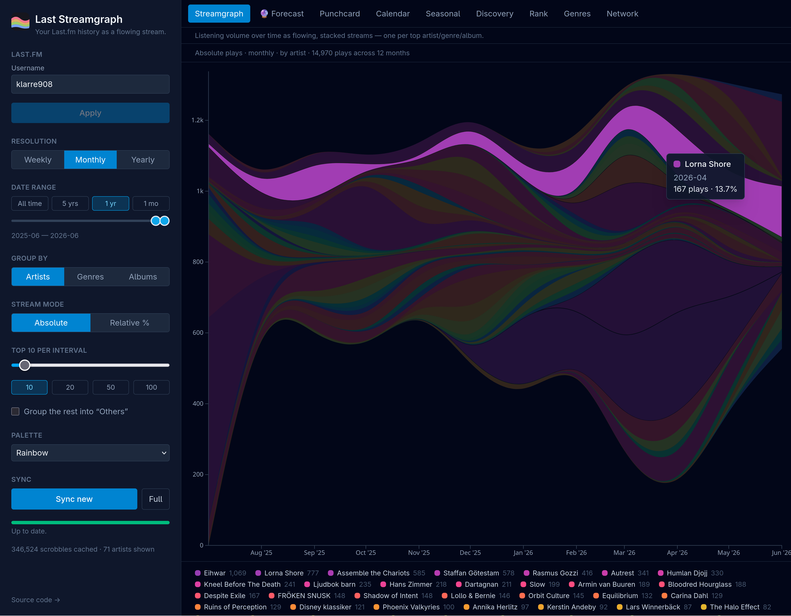
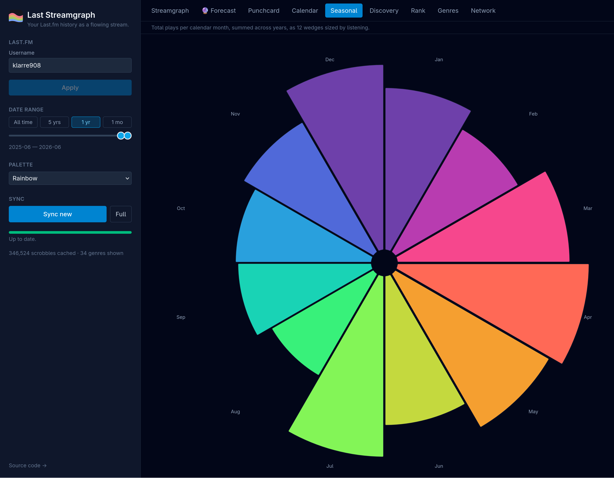
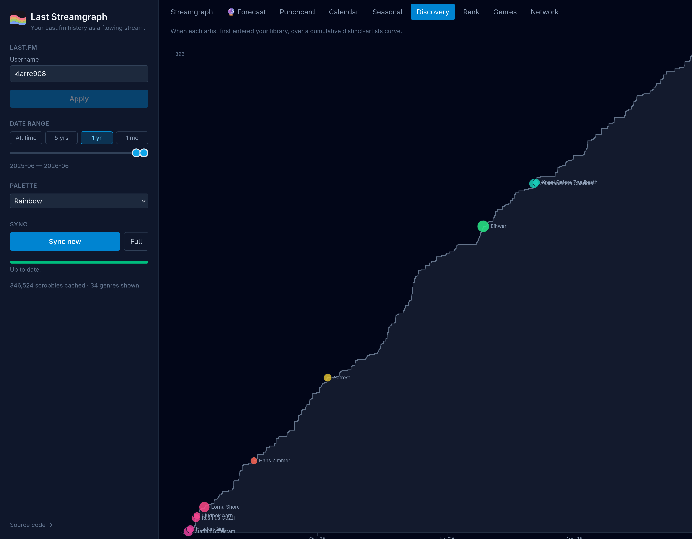
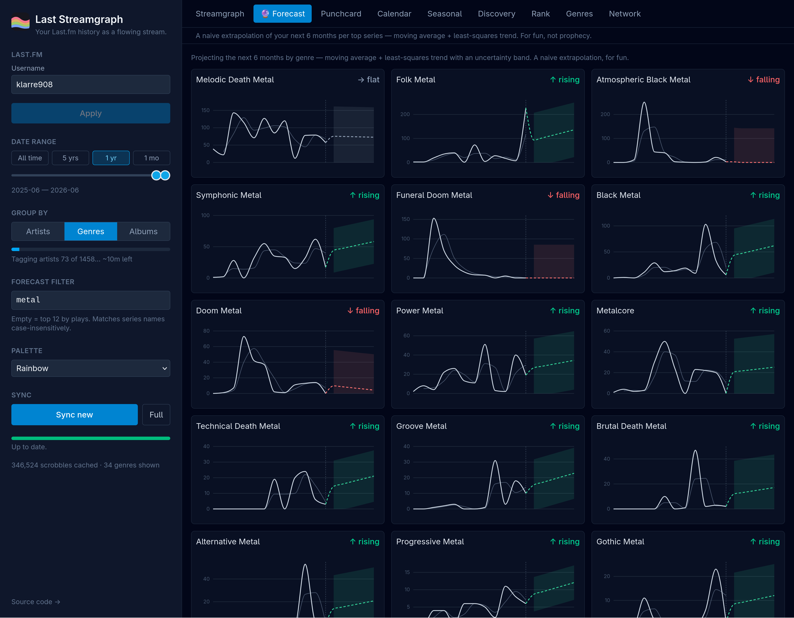

# Last Streamgraph

**See your music listening as a flowing river of color.**

Last Streamgraph turns your [Last.fm](https://www.last.fm) scrobbles into living,
colorful pictures of your taste — how it flows, shifts, and grows over the years.
Connect your account and watch your listening history come to life.



## What it does

Everyone's listening has a shape. Some artists carry you for a season and fade;
some genres swell in winter; some weeks you binge one album into the ground.
Last Streamgraph finds those patterns in your own history and draws them.

Once you've connected your account, you can explore your music in lots of ways:

- **Streamgraph** — a smooth, rippling river where each colored band is an artist
  (or a genre, or an album). The wider the band, the more you listened. Follow a
  favorite swelling and shrinking across the years, switch between raw play counts
  and percentages, and zoom into any stretch of time.
- **When you listen** — a heatmap of your week, days down the side and hours across
  the top. The hotter the square, the more you were listening then. A surprisingly
  personal portrait: late-night listener? Sunday-afternoon binger?
- **Calendar** — every day you've ever scrobbled, laid out like a calendar and
  shaded by how much you listened — an easy way to spot streaks, quiet spells, and
  your busiest months.
- **Breakdown** — your library as two rings, one level apart: genres and each
  genre's top artists, or artists and their albums, or albums and their tracks —
  whichever Group-by is set to. So you can finally see just how much black metal,
  soundtrack, or pop you really listen to.
- **Forecast** 🔮 — for fun, it looks at the recent trend of each genre and
  sketches where it *might* be heading over the next few months — from surging
  down through easing and falling to long dead. (A playful guess, not a real prediction — your next obsession
  is always a surprise.)
- **Obsessions** — the tracks you played into the ground. Not your favourites by
  total plays, but your *binges*: the song that took over one week in March and
  then vanished, drawn as a wall of spikes on one shared timeline.
- **New vs. old** — were you exploring, or comforting yourself? Each month's plays
  split into artists you'd never heard before and ones you already knew, with the
  new-share traced on top as a kind of openness index.
- **Tenure** — lifers vs. flings. One bar per artist, from their first play to
  their last, so you can see who stayed for a decade and who burned bright for a
  fortnight.
- **Retention** — how fast each year's discoveries faded. Artists are grouped by
  the year you found them, and each year gets a *half-life*: the age by which
  half the plays that batch would ever give you had already happened. One bar per
  year on a shared scale, so the trend in your own attention is just the shape of
  the column — did your 2019 obsessions burn out in six weeks while your 2015 ones
  settled into rotation? Cohorts too young to judge are drawn hollow, not guessed
  at.
- **Year on year** — every year as its own cumulative curve on one day-of-year
  axis. Which year was the heavy one, and are you ahead of where you were this
  time last year?
- **Genre clock** — what you play at 3am. Each genre gets its own row of 24 hours,
  scaled to its own peak and sorted from morning listening down to nocturnal, so
  the small genres' habits show up as clearly as the big ones'.
- **Sessions** — your listening in sittings rather than plays: how many, how long a
  typical one runs, when they tend to start, and your single longest binge.
- **Albums** — breadth against depth. How many of an album's tracks you've played
  versus how often; the ones you lived inside pull away from the ones you sampled
  once.
- **Seasonal** — which artists (or genres, or albums) belong to a time of year.
  Every month is measured against your own listening that month, so unequal month
  lengths and a mid-year account start cancel out instead of masquerading as a
  summer bump. Ranked by how tightly a name clusters in the calendar *and* how
  many separate years agree on when — one hot summer is a phase, not a season.
  A name has to be half a percent of your listening to earn a card, and the
  results filter by name, peak season, or play count.
- **Discovery** — a timeline of when you found each artist.
- **Rank** — how your top artists rise and fall against each other.
- **Affinity network** — clusters the artists you tend to play together.


## Sharing a chart

Every view has a **Share** button. It offers two things:

- **Copy link** — a self-contained snapshot. The chart's own data is compressed
  into the URL fragment, so opening the link draws exactly what you saw, forever,
  with no account and no API key. It carries only what that one chart plots — no
  username, and nothing about the rest of your library. Because it lives after
  the `#`, it never reaches the server either, so it stays out of the access logs
  of whoever is hosting the app.
- **Save PNG** — the chart as an image, for the charts whose data is too big to
  fit in a link (a 15-year calendar, say) and for anywhere a picture travels
  better than a URL.

Links open at `/s` as a standalone poster rather than inside the app. Note that
this is still your listening data: aggregate, but personal. The share panel spells
out what's in a link before you send one.

You can recolor everything with a handful of palettes, and your whole history is
saved in your browser so it loads instantly next time.

## Gallery





## Your data stays yours

Everything happens in your own browser. Your listening history is fetched straight
from Last.fm and stored locally on your machine — nothing is uploaded anywhere, and
there's no server in the middle. Your API key never leaves your computer.

## Running it

You'll need [Node.js](https://nodejs.org) (version 20 or newer) installed.

```bash
npm install
npm run dev
```

Then open the address it prints (usually <http://localhost:5173>) in your browser.

In the panel on the left, enter two things:

1. **A Last.fm API key.** Create one for free at
   <https://www.last.fm/api/account/create> — fill in any name/description; you
   only need the *API key* it gives you (not the secret).
2. **Your Last.fm username.**

The first load fetches your full history (this can take a while if you have a lot
of scrobbles — it shows progress, and it's safe to close and come back; it picks up
where it left off). After that, it only grabs new plays, so it's quick.

### Sharing a link

The username lives in the URL path, so `https://your-host/klarre908` opens
straight onto that person's history. Use the **Copy share link** button next to
the username field to grab a link to send — or just copy the address bar, which
always reflects the current username.

The API key is *never* part of the link (it's a per-viewer secret). Whoever opens
a shared link still needs their own API key entered once; from then on, any link
just swaps which username is shown.

To build a production version: `npm run build`, then `npm run preview`.

## Hosting it for others

If you run a public instance, you can bake in a Last.fm API key so visitors only
need to type a username (or open a shared `/username` link) — they don't need a
key of their own.

The included systemd unit (`deploy/last-streamgraph.service`) reads the key from
an optional environment file and writes it into `dist/config.js` on each start:

```bash
echo 'LASTFM_API_KEY=your-read-only-key' | sudo tee /etc/last-streamgraph.env
sudo systemctl restart last-streamgraph
```

Rotating the key is just editing that file and restarting — no rebuild needed.
If no key is set, the app falls back to asking each visitor for their own.

> **Heads-up:** a key served to the browser is *publicly readable* — anyone can
> read it from the network tab and use it against your rate limit. Only ever use
> a read-only API key here, never the shared secret.

## License

Last Streamgraph is free software, licensed under the
[GNU General Public License v3.0 or later](LICENSE).
