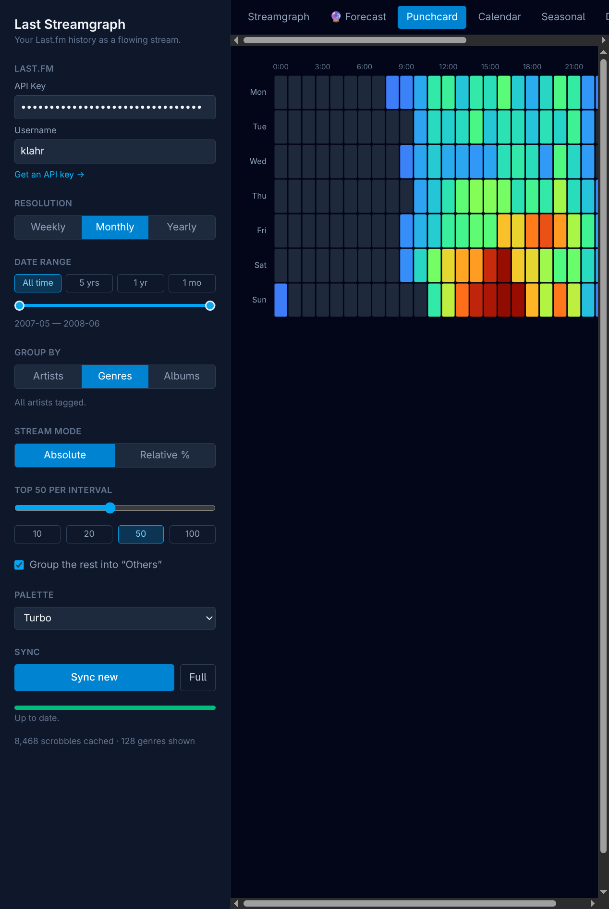
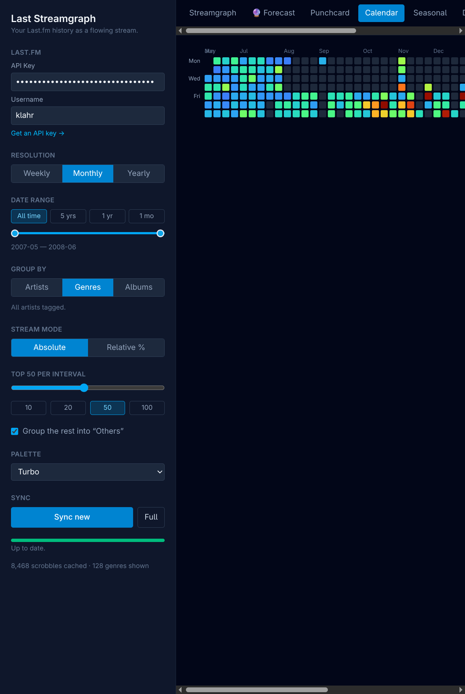
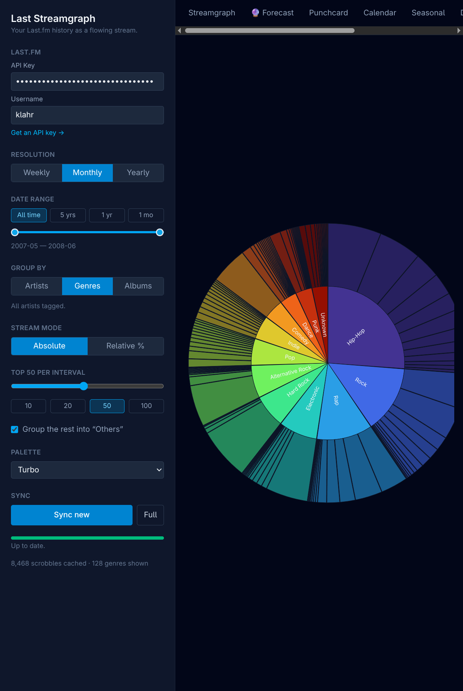

# Last Streamgraph

**See your music listening as a flowing river of color.**

Last Streamgraph turns your [Last.fm](https://www.last.fm) scrobbles into living,
colorful pictures of your taste — how it flows, shifts, and grows over the years.
Connect your account and watch your listening history come to life.


## What it does

Everyone's listening has a shape. Some artists carry you for a season and fade;
some genres swell in winter; some weeks you binge one album into the ground.
Last Streamgraph finds those patterns in your own history and draws them.

Once you've connected your account, you can explore your music in lots of ways:

### The streamgraph

The main view: a smooth, rippling river where each colored band is an artist (or
a genre, or an album). The wider the band, the more you listened. You can follow
a favorite swelling and shrinking across the years, switch between raw play counts
and percentages, and zoom into any stretch of time.

### When you listen

A heatmap of your week — days down the side, hours across the top. The hotter the
square, the more you were listening then. It's a surprisingly personal portrait:
late-night listener? Sunday-afternoon binger? It's all here.



### A calendar of every day

Every day you've ever scrobbled, laid out like a calendar and shaded by how much
you listened — an easy way to spot streaks, quiet spells, and your busiest months.



### Your genres at a glance

A colorful sunburst breaking your library into genres, and each genre into its
top artists — so you can finally see just how much black metal, soundtrack, or pop
you really listen to.



### A peek at the future 🔮

For fun, the forecast view looks at the recent trend of each genre and sketches
where it *might* be heading over the next few months — rising, falling, or holding
steady. (It's a playful guess, not a real prediction — your next obsession is
always a surprise.)


### …and more

There's also a **seasonal** view (which months of the year you listen most), a
**discovery** timeline (when you found each artist), a **rank** chart (how your
top artists rise and fall against each other), and an **affinity network** that
clusters the artists you tend to play together.

You can recolor everything with a handful of palettes, and your whole history is
saved in your browser so it loads instantly next time.

## Your data stays yours

Everything happens in your own browser. Your listening history is fetched straight
from Last.fm and stored locally on your machine — nothing is uploaded anywhere, and
there's no server in the middle. Your API key never leaves your computer.

## Running it

You'll need [Node.js](https://nodejs.org) (version 20 or newer) installed.

```bash
npm install
npm run dev
```

Then open the address it prints (usually <http://localhost:5173>) in your browser.

In the panel on the left, enter two things:

1. **A Last.fm API key.** Create one for free at
   <https://www.last.fm/api/account/create> — fill in any name/description; you
   only need the *API key* it gives you (not the secret).
2. **Your Last.fm username.**

The first load fetches your full history (this can take a while if you have a lot
of scrobbles — it shows progress, and it's safe to close and come back; it picks up
where it left off). After that, it only grabs new plays, so it's quick.

To build a production version: `npm run build`, then `npm run preview`.

## License

Last Streamgraph is free software, licensed under the
[GNU General Public License v3.0 or later](LICENSE).
